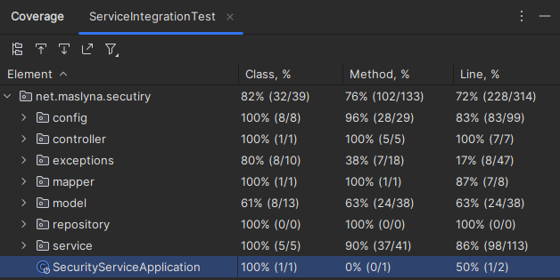
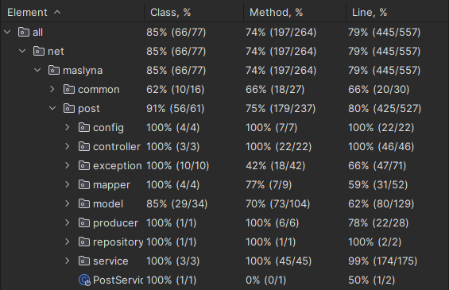

# SOCIAL-NETWORK-CLONE

###### This is simple code of default social network. I prefer to name it "parody" on different social network like: Twitter (or just X), Facebook, Linkedin, etc.

---

## Technologies stack:
- Spring Boot
- Spring Cloud
- Spring Data JPA
- PostgresSQL

---

## Main goals:

#### 1. User Authentication and Authorization:

    
> Implement a secure authentication system to allow users to create accounts, log in, and log out. 
> Use token-based authentication to ensure secure access to user-specific data. Also, manage authorization to control what actions users can perform.

#### 2. User Profile Management

>Create endpoints to handle user profiles. Users should be able to update their profiles, 
>change passwords, and manage account settings.

#### 3. Post Creation and Interaction 

>Implement functionality for users to create, edit, and delete posts. Allow users to like, comment on, and share posts.
>Consider features like attaching images or other media to posts.

#### 4. Following and Followers

>Design a system for users to follow and unfollow each other. This is crucial for building a social network where 
> users can see content from people they follow.

#### 5. Notifications

>Implement a notification system to inform users about interactions on their posts, new followers, 
> and other relevant activities.

#### 6. Hashtags and Search

>Allow users to add hashtags to their posts for categorization. Implement a search functionality 
> so users can discover posts based on hashtags or other criteria.

#### 7. Messaging System

>Consider adding a messaging system for private communication between users.

#### 8. Security

>Ensure the backend is secure by validating and sanitizing user inputs, protecting against common 
> web vulnerabilities, and regularly updating dependencies.

#### 9. Scalability

>Design the backend with scalability in mind. Social networks can grow rapidly, so consider using 
> scalable databases, caching mechanisms, and optimizing queries.

#### 10. Analytics and Insights

>Implement tracking and analytics to gather insights into user behavior. This can help improve the 
> user experience and provide valuable data for future enhancements.

#### 11. Testing

>Thoroughly test the backend code, including unit tests, integration tests, and end-to-end tests. 
> Consider using testing frameworks to automate and streamline the testing process.

#### 12. Documentation

>Provide clear and comprehensive documentation for developers who may work on the project in the 
> future. Include details on API endpoints, data models, and any specific configurations.

---

## TESTs

#### Global test coverage:
TODO: make global test coverage

#### 1. SECURITY-SERVICE coverage:

#### 2. POST-SERVICE coverage:
