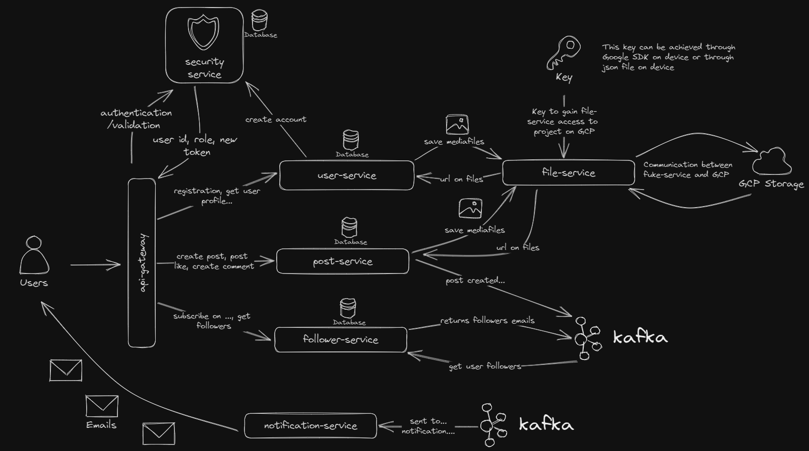
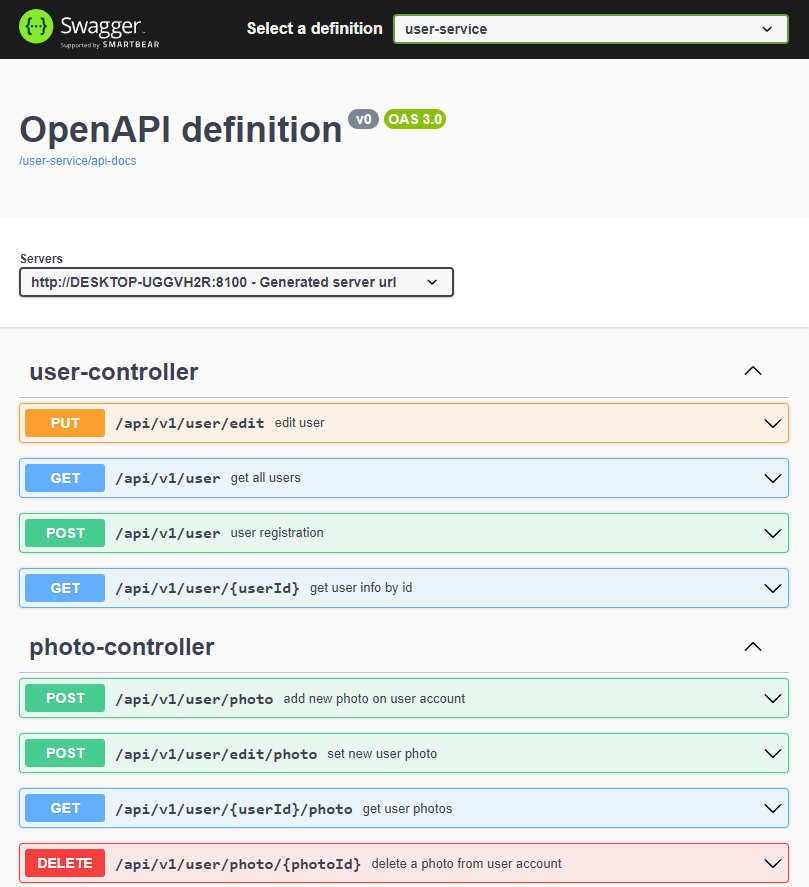
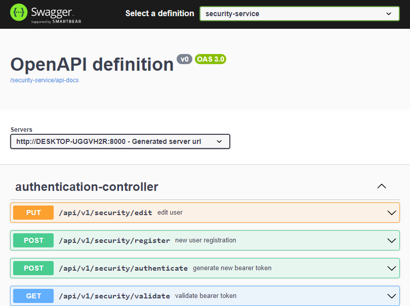
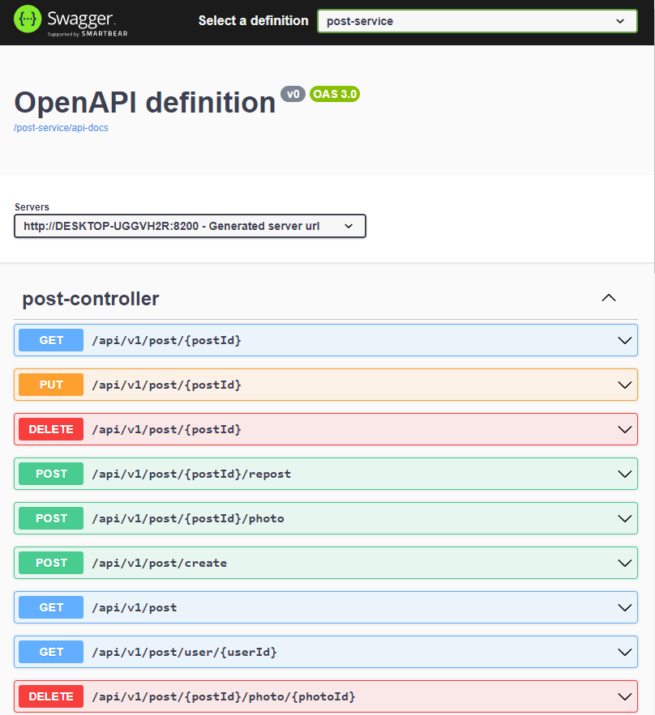
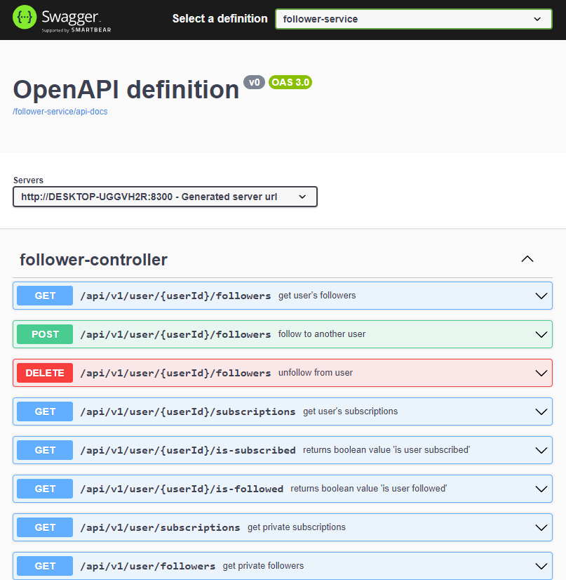
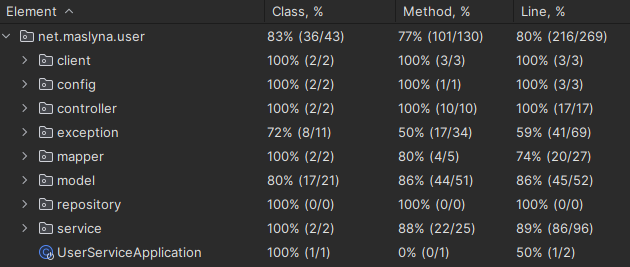

# SOCIAL-NETWORK-CLONE

###### This is simple code of default social network. I prefer to name it "parody" on different social network like: Twitter (or just X), Facebook, Linkedin, etc.

---

## Technologies stack:

- Spring Boot
- Spring Cloud
- Spring Data JPA
- PostgresSQL
- Kafka
- GCP Storage

---

## Main goals:

- [X] User Authentication and Authorization:

> Implement a secure authentication system to allow users to create accounts, log in, and log out.
> Use token-based authentication to ensure secure access to user-specific data. Also, manage authorization to control
> what actions users can perform.

- [X] User Profile Management

> Create endpoints to handle user profiles. Users should be able to update their profiles,
> change passwords, and manage account settings.

- [X] Post Creation and Interaction

> Implement functionality for users to create, edit, and delete posts. Allow users to like, comment on, and share posts.
> Consider features like attaching images or other media to posts.

- [X] Following and Followers

> Design a system for users to follow and unfollow each other. This is crucial for building a social network where
> users can see content from people they follow.

- [X] Notifications

> Implement a notification system to inform users about interactions on their posts, new followers,
> and other relevant activities.

- [X] Hashtags and Search

> Allow users to add hashtags to their posts for categorization. Implement a search functionality
> so users can discover posts based on hashtags or other criteria.

---

## Project structure

---

## API Endpoint Centralization

The API endpoints for our services are centralized and accessible via
our [API Gateway](http://localhost:8765/webjars/swagger-ui/index.html?urls.primaryName=security-service).
This centralized structure ensures easy management and provides a unified entry point to access various services within
our ecosystem. By consolidating the endpoints, we simplify the process for developers and users to interact with our
system.

#### USER-SERVICE endpoints:

#### SECURITY-SERVICE endpoints:

#### POST-SERVICE endpoints:

#### FOLLOWER-SERVICE endpoints:

---

## TESTs

#### 1. SECURITY-SERVICE coverage:

#### 2. POST-SERVICE coverage:

#### 3. FOLLOWER-SERVICE coverage

#### 4. USER-SERVICE coverage:

